<h1 align="center"> 
  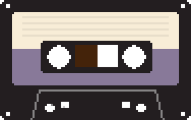 Diktafon
</h1>

<p align="center">
 <b>Voice memos on cassette tapes — transcribed and summarised entirely on your device.</b>
</p>

<p align="center">
  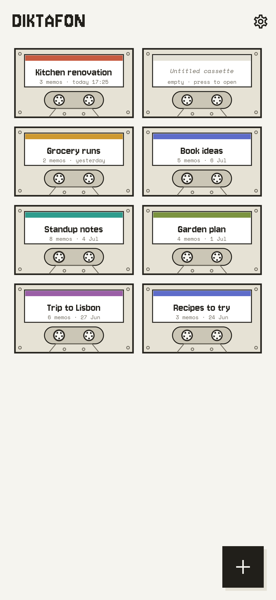
  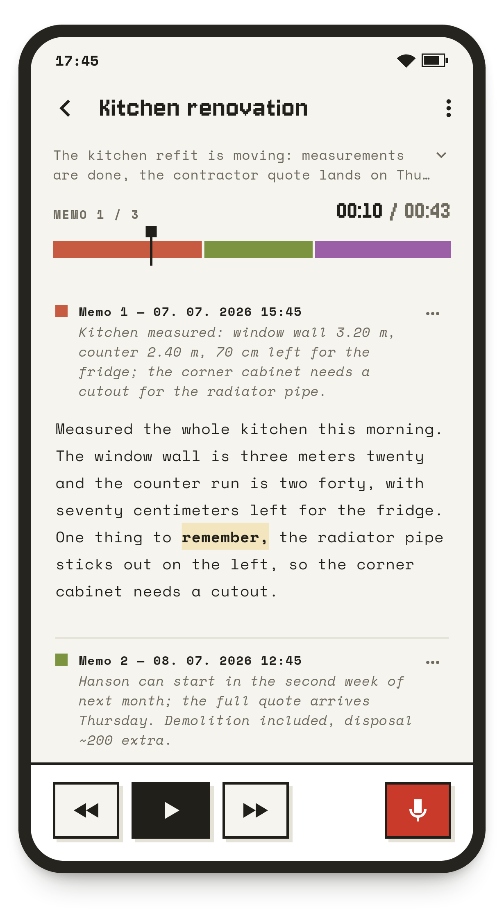
  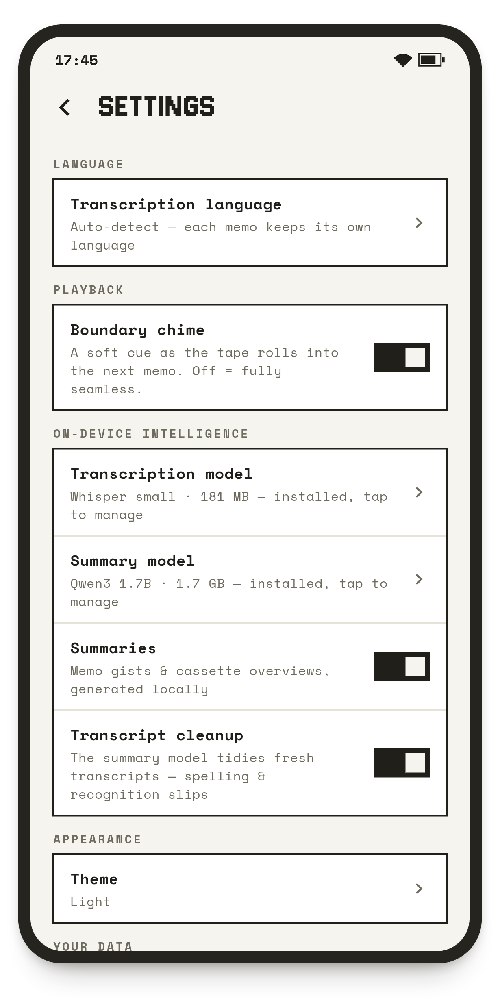
</p>

Diktafon is a voice-memo app built around one idea: capturing a thought and
finding it again later must feel effortless. The feel is nostalgic — inspired
by the tape devices of the past, memos live on topic-based **cassettes**, and
each cassette plays as **one continuous tape** of chronologically ordered
recordings.

### Key features

- 📼 **Simple to use** — Controls you already know, inspired by real tape
  recorders: keep each topic on its own cassette — press record, talk, and
  rewind to find it again.
- 🚀 **Modern** — Automatic transcriptions and summaries: every memo
  transcribed, every cassette summarised and titled.
- 🔒 **Completely private** — Transcription and summaries are computed on
  your device; no accounts, no cloud, no analytics — nothing ever leaves it.
- 🌍 **Built for you** — Speaks your language, in recordings, summaries, and
  the app itself.
- ⓪ **Free & open-source** — No cost, no ads, no lock-in; MIT-licensed —
  read the code, build it yourself, make it yours.

<p align="center">
  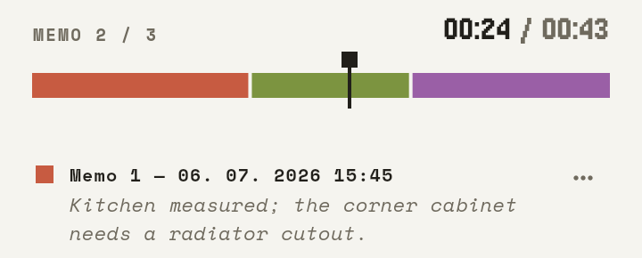 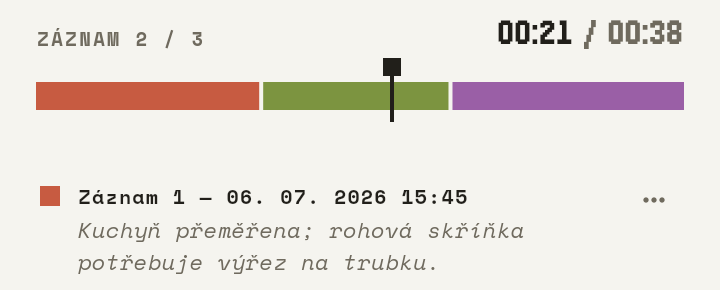  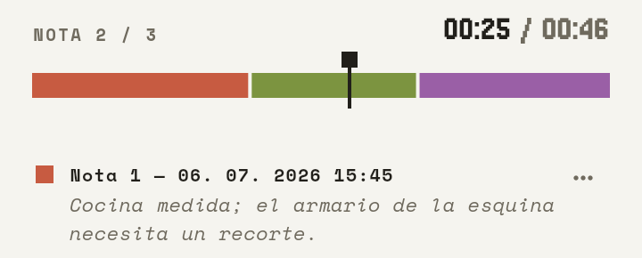 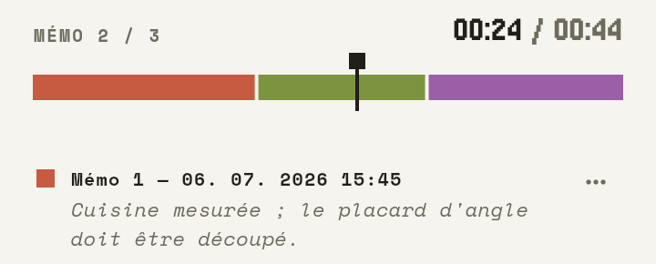 
</p>
<p align="center">
  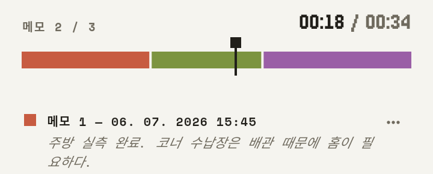 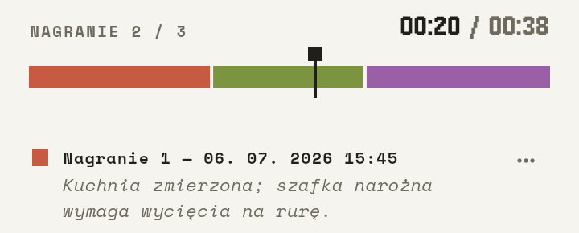 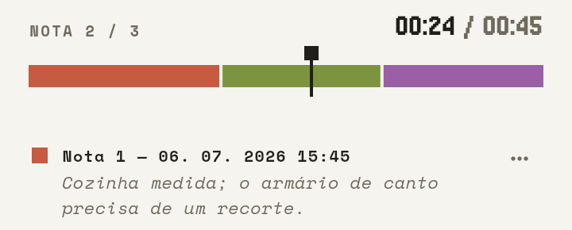 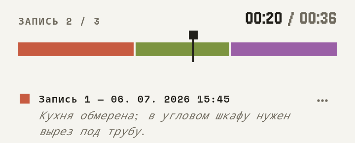 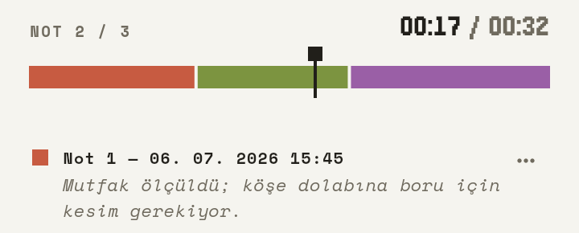
</p>
<p align="center">
  <sub>English · Čeština · Deutsch · Español · Français · 한국어 · Polski · Português · Русский · Türkçe</sub>
</p>

### More features

- **One-tap capture** — open a cassette, press record. No naming, no setup,
  no network required.
- **Tap-to-seek transcripts** — tap any word in a transcript and the tape
  jumps right there.
- **Summaries that keep up** — a one-sentence gist of each longer memo, a
  summary of the whole cassette, and suggested titles for unnamed ones.
- **Noise-aware transcription** — voice-activity detection keeps background
  noise and silence from turning into invented sentences (no phantom words
  on a windy pause), and the default model adds a rumble filter that helps
  outdoor recordings. The original audio is never altered.
- **The tape illusion** — gapless playback with a colour-coded segment bar;
  memo boundaries are marked by a soft chime (optional). Scrub, seek, and
  skip across the whole tape as if it were one recording.
- **Any language, any tape** — the spoken language is auto-detected per memo,
  so one cassette may freely mix languages.
- **Export & import** — any cassette (or all of them) exports as a single
  archive with the audio and readable text inside; importing is additive —
  nothing gets overwritten.
- **Little things** — light & dark themes, cassette colour labels,
  retranscribe-cassette, per-memo copy and delete.
- **On-device models** — transcription by Whisper, summaries by Qwen. Models
  are downloaded once on first run (Wi-Fi recommended) and can be switched in
  Settings.

## Install

Prebuilt artifacts for every release are on the
[releases page](https://github.com/jaromiru/diktafon/releases).

### Android

Download `diktafon-<version>-android-arm64-v8a.apk` (64-bit phones; the
`x86_64` APK is for emulators) and install it — you may need to allow
"install unknown apps" for your browser or file manager. Requires Android 7.0
(API 24) or newer; 4 GB RAM recommended for the default models.

Alternatively, install from a computer with
[adb](https://developer.android.com/tools/adb) (USB debugging enabled on the
device):

```bash
adb install diktafon-<version>-android-arm64-v8a.apk
```

### Linux

```bash
tar xzf diktafon-<version>-linux-x64.tar.gz
# Runtime dependencies: playback (libmpv), recording (parecord + ffmpeg)
sudo apt install libmpv2 pulseaudio-utils ffmpeg
./diktafon-<version>-linux-x64/diktafon
```

Built on Ubuntu 24.04 (glibc 2.39); older distributions should build from
source instead.

### Verifying a download

Each release ships a `SHA256SUMS` file, and all artifacts carry a GitHub
[build-provenance attestation](https://docs.github.com/en/actions/security-for-github-actions/using-artifact-attestations)
proving they were built by this repository's release workflow:

```bash
sha256sum -c SHA256SUMS --ignore-missing
gh attestation verify diktafon-<version>-android-arm64-v8a.apk --repo jaromiru/diktafon
```

## Building from source

Prerequisites:

- **Flutter 3.44.5** (stable) — newer versions may work but are untested.
- **Linux target:** clang, cmake, ninja-build, pkg-config, libgtk-3-dev
  (plus the runtime packages above).
- **Android target:** Android SDK with NDK 28.2.13676358 and Java 17.
  whisper.cpp and llama.cpp are vendored under `native/` and built
  automatically by the Flutter build (CMake / `externalNativeBuild`).

```bash
git clone https://github.com/jaromiru/diktafon.git
cd diktafon
flutter pub get

flutter run -d linux                     # desktop dev run
flutter build linux --release            # → build/linux/x64/release/bundle/
flutter build apk --release --split-per-abi \
  --target-platform android-arm64,android-x64  # → build/app/outputs/flutter-apk/

# Install on a connected Android device (-r replaces an existing install):
adb install -r build/app/outputs/flutter-apk/app-arm64-v8a-release.apk
```

Release APKs are signed with the debug key unless you provide
`android/key.properties` (see the [Flutter signing docs](https://docs.flutter.dev/deployment/android#sign-the-app);
the file and keystores are gitignored).

### Tests

```bash
flutter analyze && flutter test          # static analysis + unit/widget tests
flutter test integration_test -d linux   # end-to-end flows on the desktop build
```

The integration tests cover record → play → transcribe → summarize flows.
The transcription and summarization steps run the real engines only when
pointed at locally downloaded models, and skip cleanly otherwise:

```bash
export DIKTAFON_WHISPER_MODEL=/path/to/ggml-tiny-q5_1.bin  # huggingface.co/ggerganov/whisper.cpp
export DIKTAFON_LLM_MODEL=/path/to/Qwen3-0.6B-Q8_0.gguf    # huggingface.co/Qwen/Qwen3-0.6B-GGUF
flutter test integration_test -d linux
```

## Acknowledgments & License

Designed by Jaromír Janisch, implemented by
[Claude Code](https://claude.com/claude-code).

Licensed under MIT — see [`LICENCE.md`](LICENCE.md) for details, including
the licences of the vendored engines, bundled fonts, the bundled Silero VAD
model, and the runtime-downloaded models. The software is provided "as is",
without warranty of any kind.
