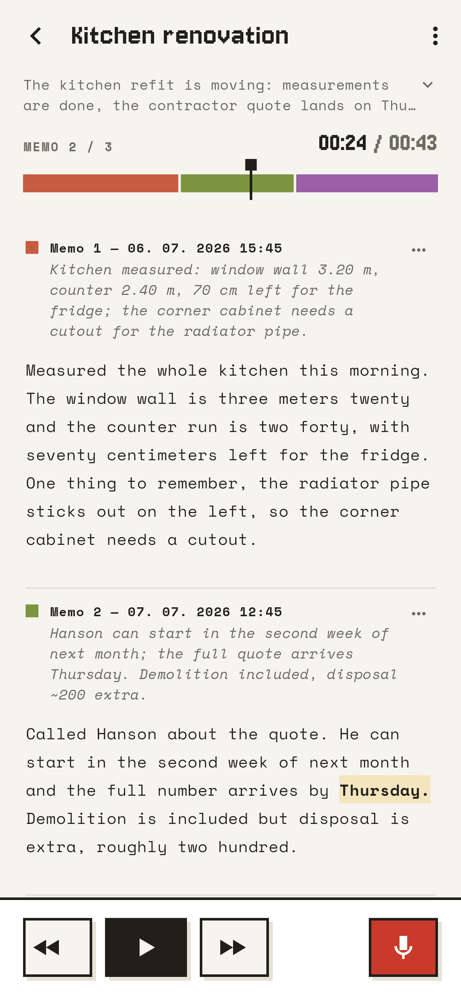

#  Diktafon

**Voice memos on cassette tapes — transcribed and summarized entirely on your device.**

<p align="center">
  
  
</p>

Diktafon is a voice-memo app built around one idea: capturing a thought and
finding it again later must feel effortless. The feel is nostalgic — inspired
by the tape devices of the past, memos live on topic-based **cassettes**, and
each cassette plays as **one continuous tape** of chronologically ordered
recordings. The features are modern: automatic transcription, summaries, and
suggested titles, all computed **locally, on the device** — audio and text
never leave it.

## Features

- **One-tap capture** — open a cassette, press record. No naming, no setup, no
  network required.
- **On-device transcription** — every memo is transcribed by
  [whisper.cpp](https://github.com/ggml-org/whisper.cpp) with **word-level
  timing**: tap any word in the transcript to jump the audio there.
- **On-device summaries** — a small local LLM
  ([llama.cpp](https://github.com/ggml-org/llama.cpp) running Qwen3) writes a
  1–2 sentence gist of each memo, keeps a rolling summary of the whole
  cassette, and suggests a title for unnamed cassettes. It also gently cleans
  the transcript (fillers, obvious slips) — the raw transcript is kept and the
  cleanup can be turned off.
- **The tape illusion** — a cassette plays as a single gapless timeline with a
  color-coded segment bar; memo boundaries are marked by a soft chime
  (optional). Scrub, seek, and skip across the whole tape as if it were one
  recording.
- **Ten languages** — English, Czech, German, Spanish, French, Korean, Polish,
  Portuguese, Russian, Turkish: transcription (auto-detected per memo — one
  tape may mix languages), summaries, and the UI itself.
- **Private by default** — no accounts, no cloud, no analytics. The only
  network traffic is the one-time, user-initiated download of the ML models.
- **Export** — any cassette exports to a folder of audio files plus
  `transcript.md` and `cassette.json`.
- Light & dark themes, cassette color labels, retranscribe-cassette,
  per-memo copy/delete.

## On-device models

Models are downloaded on first run (Wi-Fi recommended), verified against
pinned SHA-256 hashes, and can be switched later in Settings:

| Task | Model | Download | Notes |
|---|---|---|---|
| Transcription | Whisper tiny | ~31 MB | fastest, lowest accuracy |
| | **Whisper small** | ~181 MB | default — good multilingual balance |
| | Whisper large-v3-turbo | ~547 MB | best accuracy; needs a capable device (~2.5 GB RAM while transcribing) |
| Summaries | **Qwen3 1.7B** (Q8_0) | ~1.7 GB | default |
| | Qwen3 4B | ~2.3 GB | better summaries; offered on devices with ≥ 6 GB RAM |

Models come from the official Hugging Face repositories
([ggerganov/whisper.cpp](https://huggingface.co/ggerganov/whisper.cpp),
[Qwen](https://huggingface.co/Qwen)); they are not bundled with the app or
this repository.

## Install

Prebuilt artifacts for every release are on the
[releases page](https://github.com/jaromiru/diktafon/releases).

### Android

Download `diktafon-<version>-android-arm64-v8a.apk` (64-bit phones; the
`x86_64` APK is for emulators) and install it — you may need to allow
"install unknown apps" for your browser or file manager. Requires Android 7.0
(API 24) or newer; 4 GB RAM recommended for the default models.

Alternatively, install from a computer with
[adb](https://developer.android.com/tools/adb) (USB debugging enabled on the
device):

```bash
adb install diktafon-<version>-android-arm64-v8a.apk
```

### Linux

```bash
tar xzf diktafon-<version>-linux-x64.tar.gz
# Runtime dependencies: playback (libmpv), recording (parecord + ffmpeg)
sudo apt install libmpv2 pulseaudio-utils ffmpeg
./diktafon-<version>-linux-x64/diktafon
```

Built on Ubuntu 24.04 (glibc 2.39); older distributions should build from
source instead.

### Verifying a download

Each release ships a `SHA256SUMS` file, and all artifacts carry a GitHub
[build-provenance attestation](https://docs.github.com/en/actions/security-for-github-actions/using-artifact-attestations)
proving they were built by this repository's release workflow:

```bash
sha256sum -c SHA256SUMS --ignore-missing
gh attestation verify diktafon-<version>-android-arm64-v8a.apk --repo jaromiru/diktafon
```

## Building from source

Prerequisites:

- **Flutter 3.44.5** (stable) — newer versions may work but are untested.
- **Linux target:** clang, cmake, ninja-build, pkg-config, libgtk-3-dev
  (plus the runtime packages above).
- **Android target:** Android SDK with NDK 28.2.13676358 and Java 17.
  whisper.cpp and llama.cpp are vendored under `native/` and built
  automatically by the Flutter build (CMake / `externalNativeBuild`).

```bash
git clone https://github.com/jaromiru/diktafon.git
cd diktafon
flutter pub get

flutter run -d linux                     # desktop dev run
flutter build linux --release            # → build/linux/x64/release/bundle/
flutter build apk --release --split-per-abi \
  --target-platform android-arm64,android-x64  # → build/app/outputs/flutter-apk/

# Install on a connected Android device (-r replaces an existing install):
adb install -r build/app/outputs/flutter-apk/app-arm64-v8a-release.apk
```

Release APKs are signed with the debug key unless you provide
`android/key.properties` (see the [Flutter signing docs](https://docs.flutter.dev/deployment/android#sign-the-app);
the file and keystores are gitignored).

### Tests

```bash
flutter analyze && flutter test          # static analysis + unit/widget tests
flutter test integration_test -d linux   # end-to-end flows on the desktop build
```

The integration tests cover record → play → transcribe → summarize flows.
The transcription and summarization steps run the real engines only when
pointed at locally downloaded models, and skip cleanly otherwise:

```bash
export DIKTAFON_WHISPER_MODEL=/path/to/ggml-tiny-q5_1.bin  # huggingface.co/ggerganov/whisper.cpp
export DIKTAFON_LLM_MODEL=/path/to/Qwen3-0.6B-Q8_0.gguf    # huggingface.co/Qwen/Qwen3-0.6B-GGUF
flutter test integration_test -d linux
```

## Licence

MIT — see [`LICENCE.md`](LICENCE.md), which also lists the licences of the
vendored engines, bundled fonts, and the runtime-downloaded models.
